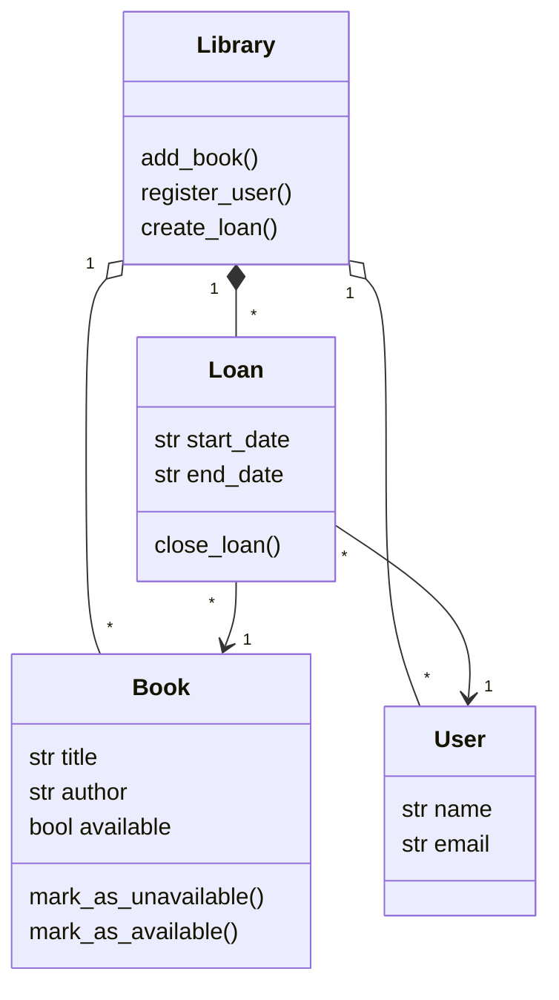
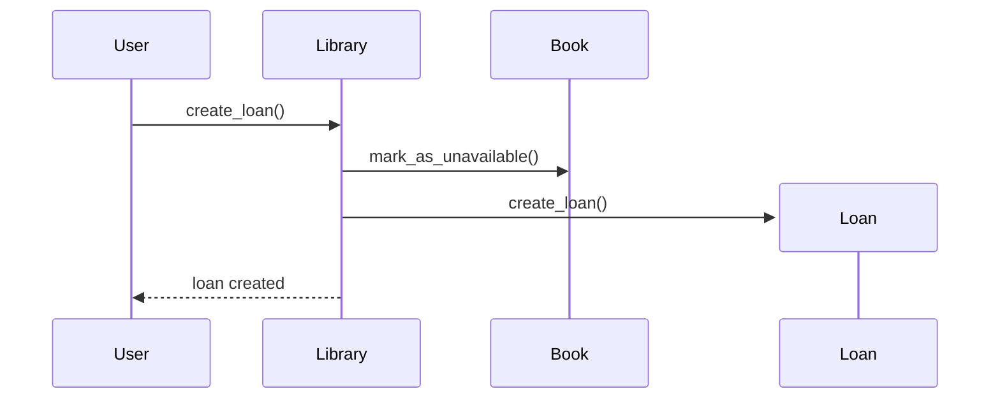

# Software Design & Architecture

Ce dépôt regroupe deux familles d'exercices sur la **conception logicielle** :
la modélisation avec **UML** (diagrammes de classes et de séquence) et la
mise en pratique de **design patterns** en Python.

---

## Sommaire

1. [Structure du dépôt](#1-structure-du-dépôt)
2. [UML : modéliser avant de coder](#2-uml--modéliser-avant-de-coder)
3. [Diagramme de classes](#3-diagramme-de-classes)
4. [Diagramme de séquence](#4-diagramme-de-séquence)
5. [Design patterns](#5-design-patterns)
6. [Pièges fréquents](#6-pièges-fréquents)
7. [Pour aller plus loin](#7-pour-aller-plus-loin)

---

## 1. Structure du dépôt

| Dossier | Contenu |
|---------|---------|
| [`uml_intro/`](./uml_intro/) | Diagrammes UML (`.mmd`, syntaxe [Mermaid](https://mermaid.js.org/)) modélisant un système de bibliothèque |
| [`design_patterns/`](./design_patterns/) | Implémentations Python de patrons de conception (Factory, Observer, Decorator) — voir son [README](./design_patterns/README.md) pour le détail |

---

## 2. UML : modéliser avant de coder

**UML** (*Unified Modeling Language*) est un ensemble de notations
graphiques standardisées pour décrire la structure et le comportement d'un
logiciel **avant** (ou pendant) son implémentation. L'intérêt : réfléchir à
l'architecture, communiquer avec d'autres développeurs, et détecter des
incohérences sans écrire une seule ligne de code.

Les fichiers `.mmd` de ce dépôt utilisent la syntaxe **Mermaid**, un langage
texte qui se transforme en diagramme (supporté nativement par GitHub,
GitLab, et de nombreux éditeurs).

---

## 3. Diagramme de classes

Un **diagramme de classes** montre les classes d'un système, leurs
attributs, leurs méthodes, et les **relations** entre elles.

[`uml_intro/0-class_diagram.mmd`](./uml_intro/0-class_diagram.mmd) modélise
une bibliothèque :



### Lire une classe

```
class Book {
    str title          <- attribut : type + nom
    str author
    bool available

    mark_as_unavailable()   <- méthode
    mark_as_available()
}
```

### Lire les relations (multiplicités et types de flèches)

| Notation | Nom | Signification |
|----------|-----|----------------|
| `"1" o-- "*"` | **Agrégation** | `Library` possède plusieurs `Book`, mais un `Book` pourrait exister sans `Library` (relation "faible") |
| `"1" *-- "*"` | **Composition** | `Library` possède plusieurs `Loan`, et un `Loan` n'a **pas de sens** sans `Library` (relation "forte", cycle de vie lié) |
| `"*" --> "1"` | **Association orientée** | Un `Loan` référence **exactement un** `Book` et **un** `User` |
| `"1"`, `"*"` | **Multiplicités** | "1" = exactement un, "*" = zéro, un ou plusieurs |

Différence agrégation/composition en une phrase : si on détruit `Library`,
les `Book` peuvent continuer d'exister ailleurs (agrégation), mais les
`Loan` n'ont plus de raison d'exister (composition).

---

## 4. Diagramme de séquence

Un **diagramme de séquence** montre **l'ordre chronologique des messages**
échangés entre objets pour réaliser un scénario précis.

[`uml_intro/1-sequence_diagram.mmd`](./uml_intro/1-sequence_diagram.mmd)
modélise la création d'un emprunt :



### Lire un diagramme de séquence

- Chaque `participant` est une **colonne verticale** représentant un objet
  ou un acteur.
- Le temps s'écoule **du haut vers le bas**.
- `A->>B: message()` : `A` envoie un message (appel synchrone) à `B`.
- `A-->>B: message` : flèche en pointillés, généralement une **réponse**.
- `create participant Loan` : un nouvel objet (`Loan`) est **créé** à ce
  moment précis du scénario.

Scénario lu ci-dessus : l'utilisateur demande un emprunt → la bibliothèque
marque le livre comme indisponible → un nouvel objet `Loan` est créé → la
bibliothèque confirme à l'utilisateur que l'emprunt est créé.

### Diagramme de classes vs diagramme de séquence

| | Diagramme de classes | Diagramme de séquence |
|---|------------------------|--------------------------|
| Vue | **Statique** (structure) | **Dynamique** (comportement) |
| Répond à | "Quelles sont les entités et leurs relations ?" | "Que se passe-t-il, étape par étape, pour ce scénario ?" |
| Élément central | Classes, attributs, relations | Messages échangés dans le temps |

Les deux sont complémentaires : le diagramme de classes décrit le "squelette"
du code (ce que deviendront vos classes Python/C), le diagramme de séquence
décrit comment ces classes **collaborent** pour un cas d'utilisation donné.

---

## 5. Design patterns

Le dossier [`design_patterns/`](./design_patterns/) met en pratique trois
patrons de conception très courants en Python — **Factory**, **Observer** et
**Decorator** — avec des exemples concrets (usine de véhicules, système de
notifications, boissons personnalisables). Voir son
[README détaillé](./design_patterns/README.md) pour le cours complet sur
chaque pattern.

Le lien avec UML : un design pattern peut lui-même être représenté par un
mini diagramme de classes (par exemple, le pattern Decorator se reconnaît à
une classe abstraite et plusieurs décorateurs qui en héritent tout en
enveloppant une instance du même type).

---

## 6. Pièges fréquents

| Erreur | Conséquence | Solution |
|--------|-------------|----------|
| Confondre agrégation (`o--`) et composition (`*--`) | Le diagramme ne reflète pas correctement le cycle de vie des objets | Se demander : "si le conteneur est détruit, l'objet contenu survit-il ?" |
| Diagramme de classes trop détaillé | Devient illisible, perd son intérêt de communication | Ne montrer que les attributs/méthodes **pertinents** pour le scénario étudié |
| Diagramme de séquence sans ordre clair | Le lecteur ne sait pas quelle étape précède quelle autre | Toujours respecter l'ordre vertical = ordre chronologique |
| Vouloir tout modéliser avant de coder | Paralysie, diagrammes qui ne correspondent jamais au code final | UML est un **outil de réflexion**, pas un contrat figé — itérer |

---

## 7. Pour aller plus loin

- **Diagramme d'états (state diagram)** : utile pour modéliser le cycle de
  vie d'un objet (ex : un `Loan` passe par les états `ouvert` → `clos`).
- **Autres design patterns** : Singleton, Strategy, Adapter, Builder — chacun
  répond à un problème de conception récurrent.
- **Principes SOLID** : ensemble de principes de conception orientée objet
  qui sous-tendent la plupart des design patterns (notamment le "O" — Open/
  Closed Principle — illustré par le pattern Factory).
